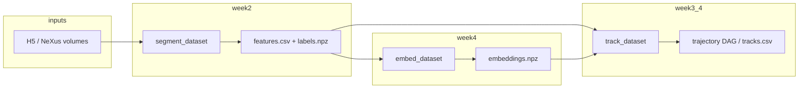

# BraggTrack architecture

This document describes how the repository is structured, how data flows through the pipeline, and where to add new functionality.

## Repository layout

```text
BraggTrack/
├── braggtrack/           # Installable Python package
│   ├── io/               # Discovery, NeXus/HDF5, beamline contracts, validation
│   ├── segmentation/     # Classical 3D segmentation + instance features
│   ├── semantic/         # Week 4: orthogonal MIPs + frozen ViT embeddings
│   ├── tracking/         # Costs, vectorised assignment, lifecycle DAG, metrics
│   └── cli/              # argparse entry points (thin orchestration)
├── data/
│   └── sample_operando/  # Bundled scan0001… folders (versioned test data)
├── docs/                 # Architecture & practices (this file)
├── scripts/              # CI glue, acceptance runners, ablation utilities
├── tests/                # unittest discovery
└── artifacts/            # Generated outputs (gitignored)
```

## Layered design

| Layer | Responsibility | Depends on |
|--------|----------------|------------|
| **io** | Find scans, load volumes, map files → `ScanVolumeMeta` / `ExperimentSequence`, validate | `numpy`, optional `h5py` |
| **segmentation** | Threshold / classical pipeline, instance table (`features.csv` contract) | `numpy`, `scipy`, `skimage` |
| **semantic** | Per-spot MIPs + encoder (`mock` or Dinov2) | `numpy`, optional `torch` + `transformers` |
| **tracking** | Pairwise cost matrix (`cdist` + optional `A @ B.T`), Hungarian assignment, DAG | `numpy`, `scipy`, `networkx` |
| **cli** | Parse args, resolve dataset root, write JSON/CSV/artifacts | All of the above |

**Rule of thumb:** put **numeric kernels** and **contracts** in subpackages; keep **CLI modules** as small glue.

## Data flow (operando week model)



- **Dataset root** is always a directory containing `scan*` folders (see `data/sample_operando/README.md`).
- **Artifacts** under `artifacts/` are reproducible outputs; never commit them.

## Extension points

1. **New beamline / file layout** — extend `discover_operando_scans` or add an adapter parallel to `BeamlineAdapter`, keeping `ScanVolumeMeta` as the contract.
2. **New segmentation** — implement alongside `segment_classical`; feed `extract_instance_table` with `(labels, intensity)`.
3. **New association cost** — implement `pairwise_cost_matrix` + scalar `__call__` matching `CostFunction` in `braggtrack/tracking/cost.py`; keep gating and `inf` semantics consistent with `associate_frames`.
4. **New CLI** — add `braggtrack/cli/foo.py`, register in `pyproject.toml` `[project.scripts]` if needed.

## Performance notes

- Assignment builds a dense `(N, M)` cost matrix via **vectorised** geometry (`scipy.spatial.distance.cdist`) and, when enabled, **one GEMM** for cosine similarity (`A @ B.T`). Avoid reintroducing per-pair Python loops on hot paths.

## Configuration surfaces

- **Env:** `BRAGGTRACK_DINO_BACKEND` (`auto` | `mock` | `torch`) for embeddings.
- **Paths:** `braggtrack.io.paths.sample_operando_root()` and `resolve_dataset_root()` for bundled vs explicit dataset roots.
