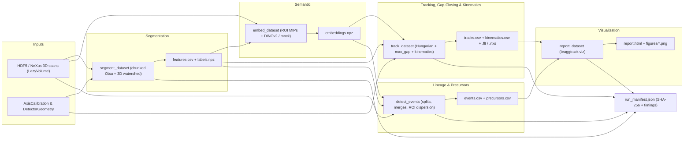

# BraggTrack architecture

This document describes how the repository is structured, how data flows through the pipeline, and where to extend functionality.

## Repository layout

```text
BraggTrack/
├── braggtrack/           # Installable Python package (v0.5.0)
│   ├── io/               # Discovery, darfix/BLISS auto-calibration, LazyVolume, OperandoLog, ImageD11 & NeXus export
│   ├── segmentation/     # Pedestal-safe 3D LoG+watershed, Poisson centroid errors, experimental batched DINO segmenter
│   ├── semantic/         # Optional (--cost-beta > 0) orthogonal (mu, chi, d) MIPs + batched ViT / patch encoders
│   ├── tracking/         # PositionShape & Wasserstein-Bures costs, slab FFT/Kalman drift, Jaqaman LAP, lineage, precursors
│   ├── autonomous/       # tell/ask/report CausalStreamingTracker, time & state-space GP(Q, V), UCB/EI ZoomTriggerPolicy
│   ├── viz/              # Publication plots (MIPs, Lineage, Operando dQ/dV, Precursors) + offline HTML 4D Explorer
│   └── cli/              # Thin argparse entry points (11 CLIs incl. braggtrack-watch, braggtrack-run, braggtrack-eval-archive)
├── data/
│   └── sample_operando/  # Bundled ESRF-ID03 Ni-rich cathode operando scans (scan0001..scan0003)
├── notebooks/            # End-to-end demo and DINO vs. classical segmentation notebooks
├── docs/                 # Architecture, ecosystem positioning, quantitative benchmarks, figures, coding practices
├── scripts/              # 9 acceptance gates, 5-scenario benchmark suite, semantic ablation, ci_report.py
├── tests/                # Unit and acceptance test suite
└── artifacts/            # Generated outputs (gitignored)
```

## Layered design

| Layer | Responsibility | Key Types / Functions | Depends on |
|---|---|---|---|
| **io** | Discover scans (`SWMR`-ready), auto-extract `darfix`/BLISS `AxisCalibration`, stream `LazyVolume`, synchronize `.mpt`/`.csv` operando logs ($\mathrm{d}Q/\mathrm{d}V$), export `ImageD11` `.flt` & NeXus `.nxs` | `LazyVolume`, `otsu_threshold_chunked`, `AxisCalibration`, `load_operando_log`, `synchronize_stimulus_to_scans`, `DetectorGeometry`, `export_imaged11_flt`, `export_nexus_process` | `numpy`, `scipy`, `h5py` |
| **segmentation** | Multi-scan threshold smoothing, `float32` 3D LoG + `h`-maxima + watershed, background pedestal subtraction, Poisson + quantization centroid error, standardized rocking-curve kurtosis $g_2$ & border truncation flags | `segment_classical`, `smooth_thresholds`, `segment_dino`, `extract_instance_table` | `numpy`, `scipy`, `scikit-image`, `scikit-learn` |
| **semantic** *(opt-in)* | Optional lazy ROI spot cropping, aspect-preserving orthogonal MIPs, batched multi-view morphological ViT embeddings (`embed_batch`) & patch-token grids (`extract_patch_features_batch`) | `crop_spot_cube`, `orthogonal_mips`, `make_multiview_encoder`, `make_patch_encoder` | `numpy`, optional `torch` + `transformers` |
| **tracking** | Step-normalized unit-invariant geometry + intensity cost (`PositionShapeCost`, optional `GeometrySemanticCost`), Jaqaman birth/death LAP with `assignment_margin`, multi-scan gap closing, ancestor `lineage_strain` + wall-clock `strain_rate_per_s`, `mechanical_split` vs. `phase_split` DAG, $O(1)$-RAM cached precursors | `PositionShapeCost`, `GeometrySemanticCost`, `resolve_track_gaps`, `build_tracks`, `compute_grain_kinematics`, `resolve_splits_and_merges`, `compute_fracture_precursors` | `numpy`, `scipy`, `networkx` |
| **autonomous** | `Bluesky-Adaptive` style `tell / ask / report` $O(1)$ sliding-window causal streaming, heteroscedastic Universal Kriging GP trajectory forecasting, `UCB` / `EI` / `max_variance` Bayesian acquisition, motor/voltage/dose/beam-flux guardrails, and staged `replay`/`shadow`/`active` evaluation | `CausalStreamingTracker`, `forecast_grain_trajectory_gp`, `score_candidates_gp`, `ZoomTriggerPolicy`, `select_zoom_targets`, `evaluate_causal_replay` | `io`, `segmentation`, `semantic`, `tracking`, `scikit-learn` |
| **viz** | Publication figures, 3-panel operando electrochemistry + fracture dashboards, and CSP-hardened zero-CDN offline interactive HTML 4D Lineage & Strain Explorer | `plot_lineage_dag`, `plot_kinematics_dashboard`, `plot_operando_strain_and_events`, `plot_precursor_timeline`, `plot_spot_mip_card`, `generate_html_report` | `numpy`, optional `matplotlib` (HTML explorer uses stdlib only) |
| **cli** | Parse args/validated JSON config, orchestrate batch or HDF5-quiescent live-watch stages, write CSV/JSON/NPZ/FLT/NXS/JSONL/HTML artifacts and SHA-256 `run_manifest.json` | `segment_dataset`, `embed_dataset`, `track_dataset`, `detect_events`, `report_dataset`, `watch_autonomous`, `run_pipeline` | All of the above |

**Rule of thumb:** keep **numeric kernels** and **typed data contracts** in subpackages; keep **CLI modules** as thin orchestration layers.

## Data flow (`braggtrack-run`)


```mermaid
flowchart LR
  subgraph inputs["Inputs"]
    H5["HDF5 / NeXus 3D scans (LazyVolume)"]
    CAL["AxisCalibration & DetectorGeometry"]
  end
  subgraph seg["Segmentation"]
    SEG["segment_dataset (chunked Otsu + 3D watershed)"]
    FEAT["features.csv + labels.npz"]
  end
  subgraph sem["Semantic"]
    EMB["embed_dataset (ROI MIPs + DINOv2 / mock)"]
    NPZ["embeddings.npz"]
  end
  subgraph trk["Tracking, Gap-Closing & Kinematics"]
    TRK["track_dataset (Hungarian + max_gap + kinematics)"]
    KIN["tracks.csv + kinematics.csv + .flt / .nxs"]
  end
  subgraph evt["Lineage & Precursors"]
    EVT["detect_events (splits, merges, ROI dispersion)"]
    OUT["events.csv + precursors.csv"]
  end
  subgraph rep["Visualization"]
    REP["report_dataset (braggtrack.viz)"]
    HTML["report.html + figures/*.png"]
  end
  MAN["run_manifest.json (SHA-256 + timings)"]

  H5 --> SEG
  CAL --> SEG
  SEG --> FEAT
  H5 --> EMB
  FEAT --> EMB --> NPZ
  FEAT --> TRK
  CAL --> TRK
  NPZ --> TRK
  TRK --> KIN
  H5 --> EVT
  FEAT --> EVT
  NPZ --> EVT
  EVT --> OUT
  KIN --> REP
  OUT --> REP --> HTML
  SEG --> MAN
  TRK --> MAN
  EVT --> MAN
  REP --> MAN
```

- **Dataset root** is a directory containing `scan*` folders (defaults to bundled `data/sample_operando/` when present).
- **Physical coordinates vs. voxel indices:** `extract_instance_table(..., calibration=cal)` converts `centroid_mu`, `centroid_chi`, `centroid_d`, `cov_*`, and `eig_1..3` into physical reciprocal-space units while preserving integer voxel `bbox_*` indices so downstream 3D ROI cropping (`crop_spot_cube` over `LazyVolume`) remains exact.
- **Artifacts** under `artifacts/` are reproducible build outputs and are never committed to Git.

## Extension points

1. **New beamline / HDF5 layout** — add candidate paths to `PRIMARY_VOLUME_CANDIDATES` in `braggtrack/io/nexus.py` (or rely on the built-in largest-3D numeric dataset discovery) and extend `extract_axis_calibration` if custom motor metadata groups are used.
2. **New segmentation method** — implement alongside `segment_classical` / `segment_dino` returning `ClassicalSegmentationResult`, then feed `(labels, volume, calibration=...)` to `extract_instance_table`.
3. **New association cost** — implement `pairwise_cost_matrix` + scalar `__call__` matching `CostFunction` in `braggtrack/tracking/cost.py`.
4. **Custom precursor signals** — extend `compute_fracture_precursors` in `braggtrack/tracking/precursors.py` to incorporate additional morphological or diffraction rocking-curve descriptors while retaining contiguous `min_persistence` filtering.

## Performance notes

- `LazyVolume` streams `z`-slabs (`otsu_threshold_chunked`) in Pass 1 of `segment_dataset` and reads only tight 3D spot ROIs (`read_roi`) in `embed_dataset` and `detect_events`, avoiding full-volume `float64` allocations on multi-gigabyte detector stacks.
- Frame-to-frame Hungarian association and multi-scan gap closing (`resolve_track_gaps`) build cost matrices via vectorised `scipy.spatial.distance.cdist` and dense matrix multiplication (`A @ B.T`) for semantic cosine similarity.

## Configuration surfaces

- **Environment variables:**
  - `BRAGGTRACK_DATA_ROOT`: Override default dataset root discovery.
  - `BRAGGTRACK_DINO_BACKEND`: Force `auto`, `mock`, or `torch` backend selection.
- **Pipeline JSON config:** Pass `--config pipeline.json` to `braggtrack-run` to declaratively configure backend, model ID (`DEFAULT_DINO_MODEL = "facebook/dinov2-small"` or DINOv3), calibration/detector JSON files, `max_gap`, semantic weights (`cost_alpha`, `cost_beta`), split/precursor thresholds, `--report`, and `ImageD11` / NeXus export paths.
